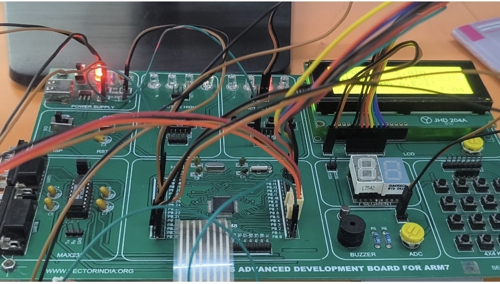
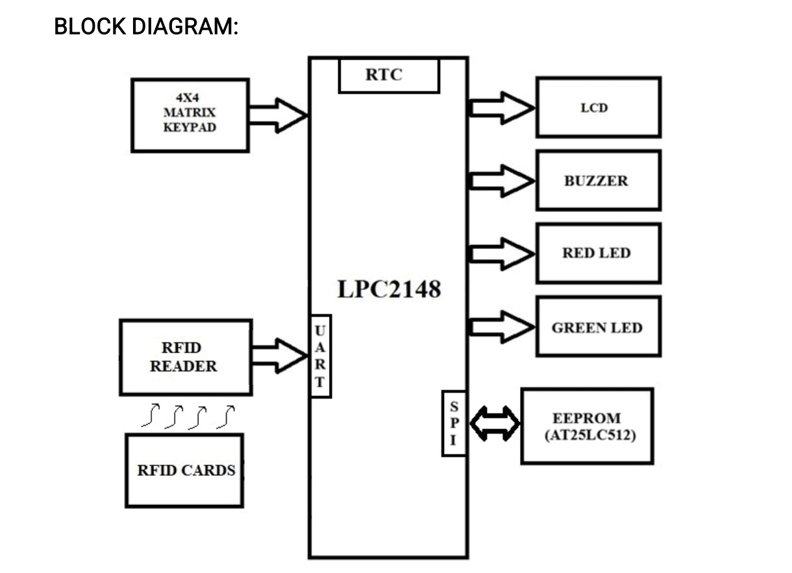

# RFID-Based Unified Citizen Service Management System

### Embedded Systems Project Using LPC2148 ARM7

## 📌 Project Overview

The RFID-Based Unified Citizen Service Management System is an embedded system developed using the **LPC2148 ARM7 microcontroller**. It uses RFID-based identification to provide multiple citizen services through an LCD and keypad interface.

The system integrates RFID, UART, SPI EEPROM, RTC, LCD, and keypad peripherals to authenticate users and manage service-related information.

## 📸 Project Hardware Kit



*Hardware setup of the RFID-based citizen service management system.*

## 🏗️ System Block Diagram



*Block diagram showing the major hardware modules and their interactions.*

## 🎯 Objectives

* Identify users using RFID cards.
* Authenticate users using stored RFID card IDs.
* Provide multiple citizen services through a menu-driven interface.
* Store user information and transaction data in SPI EEPROM.
* Implement password-protected services.
* Provide ATM balance enquiry, deposit, and withdrawal.
* Implement one-vote-per-user voting.
* Check driving licence expiry using RTC.
* Provide officer-level administrative operations.
* Indicate valid and invalid cards using LEDs and a buzzer.

## ⚙️ Hardware Components

* LPC2148 ARM7 Microcontroller
* RFID Reader and RFID Cards
* 16×2/20×4 LCD
* 4×4 Keypad
* AT25LC512 SPI EEPROM
* RTC Module
* Green LED and Red LED
* Buzzer

## 💻 Software and Technologies

* **Microcontroller:** LPC2148 ARM7
* **Programming Language:** Embedded C
* **Communication:** UART and SPI
* **Development Environment:** Embedded C development tools
* **Storage:** AT25LC512 SPI EEPROM

## 🔄 Working Principle

1. The system initializes the UART, SPI, LCD, keypad, RFID interface, and RTC.
2. It checks EEPROM connectivity and project initialization data.
3. The RFID reader reads the card and sends its data to the LPC2148 through UART.
4. The microcontroller compares the received card ID with the IDs stored in EEPROM.
5. For a valid citizen card, the system displays the available service menu.
6. For an officer card, the system opens the officer menu.
7. Invalid cards trigger the red LED and buzzer indications.
8. Relevant user information and service data are stored or updated in EEPROM.

## 🧩 Main Features

### 🪪 1. PAN Card Service

* Password-protected access.
* Displays citizen name, date of birth, and PAN number.

### 💳 2. ATM Service

* Balance enquiry.
* Deposit and withdrawal.
* Transaction validation and balance updates in EEPROM.

### 🗳️ 3. Voting Service

* Provides Party A, Party B, Party C, Party D, and NOTA options.
* Allows one vote per registered user.
* Stores voting status and vote counts in EEPROM.

### 🚗 4. Driving Licence Service

* Checks driving licence expiry using stored expiry information and RTC date.
* Provides an officer function to update expired licence information.

### 👮 5. Officer Menu

* Reset voting counts and user voting flags.
* Update driving licence expiry information.

### 🔐 6. Password Management

* Password-protected access.
* Three-attempt password verification.
* Password change functionality with EEPROM storage.

## 📡 Communication and Storage

* **UART0:** Communication between the RFID reader and LPC2148.
* **SPI0:** Communication between the LPC2148 and AT25LC512 EEPROM.
* **EEPROM:** Stores RFID card IDs, passwords, balances, voting information, and driving licence expiry data.
* **RTC:** Provides date and time information for date-dependent operations.
* **LCD and Keypad:** Provide user interaction and menu navigation.

## 📂 Project Structure

```text
RFID-Based-Unified-Citizen-Service-Management-System/
│
├── images/
│   ├── kit_image.jpg
│   └── block_diagram.png
│
├── headerfiles/
│   ├── defines.h
│   ├── delay.h
│   ├── kpm1.h
│   ├── lcd.h
│   ├── menu_rfid.h
│   ├── rfid.h
│   ├── rtc.h
│   ├── spi.h
│   ├── spi_eeprom.h
│   ├── types.h
│   └── uart.h
│
├── sourcefiles/
│   ├── delay.c
│   ├── kpm1.c
│   ├── lcd.c
│   ├── menu_rfid.c
│   ├── rfid.c
│   ├── rtc.c
│   ├── spi.c
│   ├── spi_eeprom.c
│   └── uart.c
│
├── Startup.s
└── main_rfid.c
```

## 🚀 How to Use

1. Power on the LPC2148 hardware.
2. Wait for the RFID scanning screen.
3. Scan a registered RFID card.
4. Select a service using the keypad after successful authentication.
5. Enter the password when required.
6. Perform the selected operation and view the result on the LCD.
7. Use the officer card to access administrative functions.

## 🎓 Learning Outcomes

This project demonstrates practical implementation of:

* ARM7 microcontroller programming
* Embedded C development
* RFID interfacing
* UART communication and interrupt-based reception
* SPI communication and EEPROM interfacing
* LCD and keypad interfacing
* RTC integration
* Non-volatile data storage
* Menu-driven embedded system design

## 👩‍💻 Author

**Chevula Navya**

B.Tech – Electronics and Communication Engineering


---
